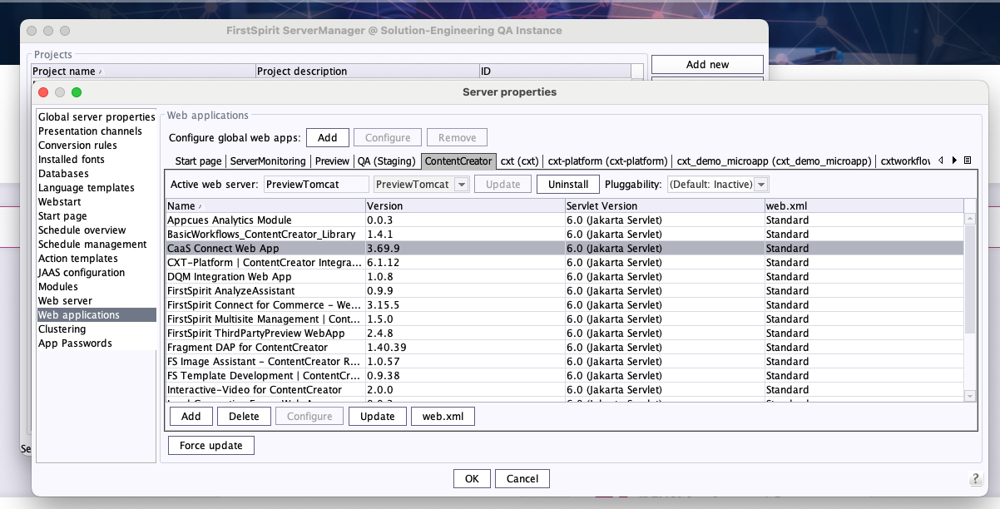
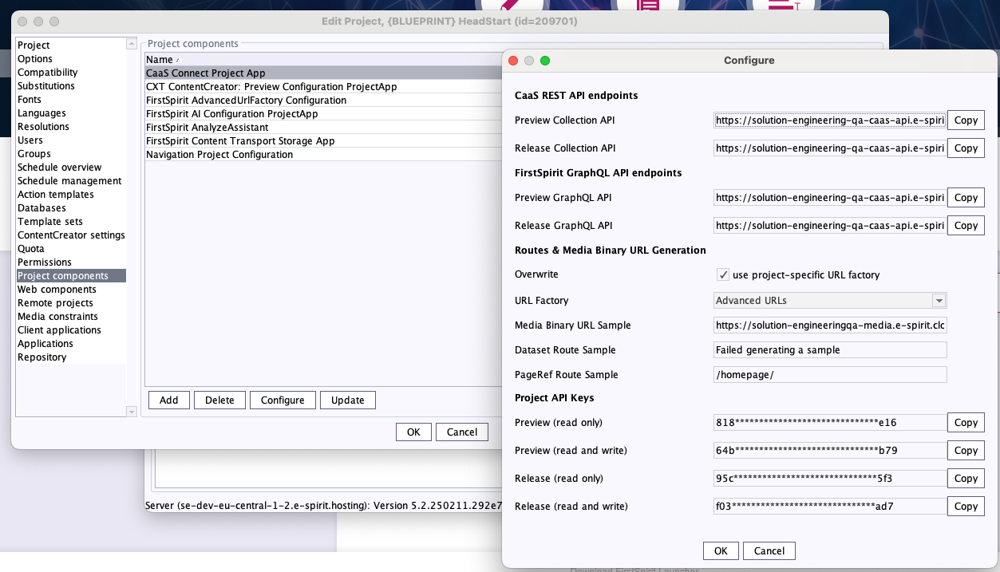
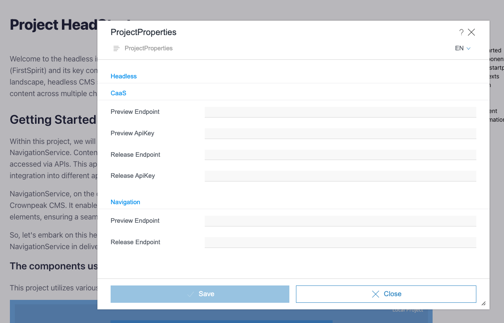
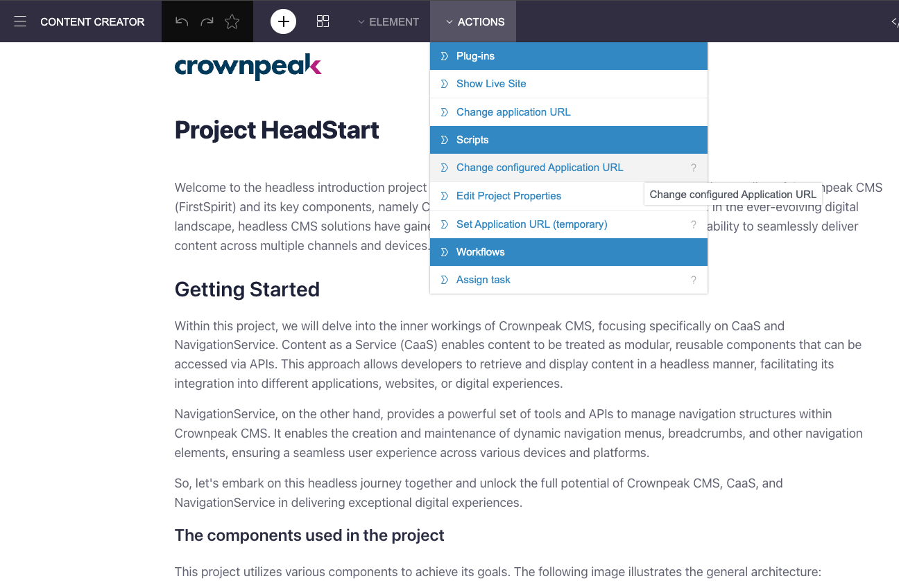

# Project HeadStart - Crownpeak CMS Headless Introduction

Welcome to the Crownpeak CMS (FirstSpirit) Headless Introduction project. This guide aims to provide you with a comprehensive understanding of Crownpeak CMS, its key components, and how it can enhance your digital content management experience.

In today's rapidly evolving digital landscape, headless CMS solutions have become increasingly popular. Crownpeak CMS, also known as FirstSpirit, is a leading headless CMS that offers flexibility and seamless content delivery across various channels and devices.

For more information about FirstSpirit or Crownpeak DXP please
use [this contact form](https://www.crownpeak.com/#main_form) to get in touch.

## How to use

### Run HeadStart frontend

Install the project using `npm install`.

To start the project, use the `npm run dev` command.

There are two options available. You can either add the CaaS and Navigation Services credentials
in the form located at http://localhost:3000, or you can open the link within the
content creator where the credentials will be automatically populated.

### HeadStart in ContentCreator

#### Server Configuration

Ensure that the **CaaS Connect WebApp** is added in the ContentCreator WebApp. This is a prerequisite for establishing the connection to the CaaS and Navigation Services.

#### Project configuration

**Install Example Project**
A [ZIP file](headstart_export.tar.gz) containing an example project is included in this repository.

**Retrieve Connection Data**
In the project settings, you can retrieve the connection data for CaaS and the Navigation Service.

**Open Project in Content Creator:**
Open the project in the ContentCreator and adopt the data.

**Set Preview URL via Script in Content Creator:**

- **Temporary:** The URL is set only for the duration of the session.
  
  
- **Permanent:** This will permanently change the URL in the project (also possible via the Server Manager).

### Storage of Connection Data

- The connection data is stored in the browser's local storage.
- The stored data always takes precedence.
- You can delete the data through the developer tools.

## Legal Notices

The Project HeadStart provides example code and a guideline for best practices. It is not a product and therefore not covered by our maintenance standards. The Project HeadStart is owned by Crownpeak Technology GmbH, Dortmund, Germany and subject to the Apache-2.0 license.

## Disclaimer

This document is provided for information purposes only. Crownpeak may change the contents hereof without notice. This document is not warranted to be error-free, nor subject to any other warranties or conditions, whether expressed orally or implied in law, including implied warranties and conditions of merchantability or fitness for a particular purpose. Crownpeak specifically disclaims any liability with respect to this document and no contractual obligations are formed either directly or indirectly by this document. The technologies, functionality, services, and processes described herein are subject to change without notice.
