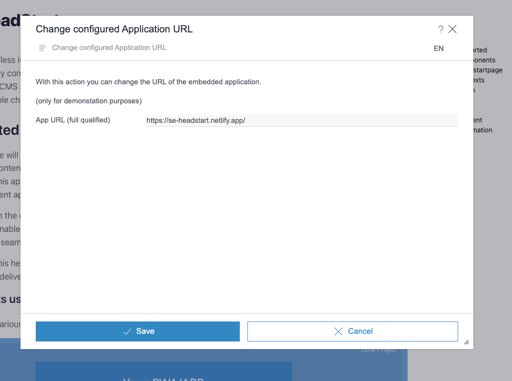

# Project HeadStart - Crownpeak CMS Headless Introduction

Welcome to the Crownpeak CMS ("FirstSpirit") Headless Introduction project. This guide aims to give you a comprehensive understanding of FirstSpirit, its key components, and how it can enhance your digital content management experience.

Headless CMS solutions have become increasingly popular in today's rapidly evolving digital landscape. FirstSpirit has a *"headless mode"* that offers flexibility and seamless content delivery across various channels and devices.

For more information about FirstSpirit or Crownpeak, please visit https://www.crownpeak.com.

## How to use

### Run HeadStart frontend
Install the project using `npm install`.

To start the project, use the `npm run dev` command.

There are two options available. You can either add the CaaS and Navigation Services credentials in the form located at http://localhost:3000, or you can open the link within the
ContentCreator, where the credentials will be automatically populated.

### HeadStart in ContentCreator

#### Server Configuration

Ensure the **CaaS Connect WebApp** is added to the ContentCreator WebApp - a prerequisite for establishing the connection to CaaS and Navigation Services.

#### Project configuration

**Install Example Project**
A [ZIP file](headstart_export.tar.gz) containing an example project is included in this repository.

**Retrieve Connection Data**
You can retrieve the connection data for CaaS and the Navigation Service in the project settings.

**Open Project in Content Creator:**
Open the project in the ContentCreator and adopt the data.

**Set Preview URL via Script in Content Creator:**

- **Temporary:** The URL is set only for the duration of the session.

  
  

- **Permanent:** This will permanently change the URL in the project (also possible via the Server Manager).

### Storage of Connection Data

- The connection data is stored in the browser's local storage.
- The stored data always takes precedence.
- You can delete the data using the developer tools.

##  Legal Notices
All Crownpeak documentation is subject to the [MIT license](./LICENSE). FirstSpirit is a trademark of Crownpeak Technology, Inc.

Copyright © 2025 Crownpeak Technology, Inc. All rights reserved.

## Disclaimer
This document is provided for information purposes only. Crownpeak may change the contents hereof without notice. This document is not warranted to be error-free, nor subject to any other warranties or conditions, whether expressed orally or implied in law, including implied warranties and conditions of merchantability or fitness for a particular purpose. Crownpeak specifically disclaims any liability with respect to this document and no contractual obligations are formed either directly or indirectly by this document. The technologies, functionality, services, and processes described herein are subject to change without notice.
is provided for information purposes only. Crownpeak may change the contents hereof without notice. This document is not warranted to be error-free, nor subject to any other warranties or conditions, whether expressed orally or implied in law, including implied warranties and conditions of merchantability or fitness for a particular purpose. Crownpeak specifically disclaims any liability with respect to this document and no contractual obligations are formed either directly or indirectly by this document. The technologies, functionality, services, and processes described herein are subject to change without notice.